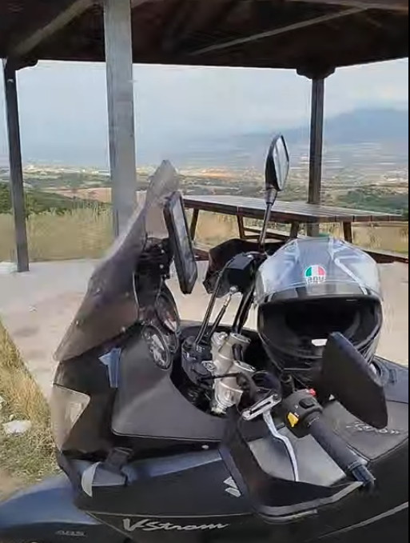

## Πρώτο ταξιδάκι 

Τρεις ώρες περίπου πάνω στη μηχανή για 125 χιλιόμετρα κυρίως σε επαρχιακές οδούς με στροφές και πολύ φύση. 

Μετά το χαμό στον περιφερειακό, οι επαρχιακοί δρόμοι ήταν έρημοι. Αυτοκίνητα έβλεπα κάθε 5-10 χιλιόμετρα. 

Η διαδρομή Βασιλικά - Μονοπήγαδο - Κρήνη - Πετράλωνα - Σίλατα υπέροχη. 

Το ίδιο και από Νέα Καλλικράτεια παραλιακά Νέα Ηράκλεια - Επανομή. 

## Οι στροφές 

Οι στροφές από Παπανικολάου προς Πανόραμα όπου η ταχύτητα των οχημάτων μπορεί να ξεπερνά και τα 100 χιλιόμετρα λόγω του φαρδύ δρόμου, όπως και η κατηφορική κλίση είναι αυτές που με δυσκόλεψαν περισσότερο και από το φιδωτό δρόμο στο ανέβασμα για Μονοπήγαδο. 

Φάνηκε η απειρία μου. Δεν ήμουν σίγουρος για την ταχύτητα που έπρεπε να μπω στη στροφή. 

Σε αυτη την περίπτωση προτιμώ να μπαίνω πιο αργά παρά πιο γρήγορα από ότι μπορώ να ανταπεξέλθω....

## Όμορφα σημεία

Το κιόσκι στην ανηφόρα από Βασιλικά προς Μονοπήγαδο.

Το φράγμα της Κρήνης.

Η διαδρομή δίπλα στην θάλασσα από Νέα Καλλικράτεια προς Ηράκλεια. 

