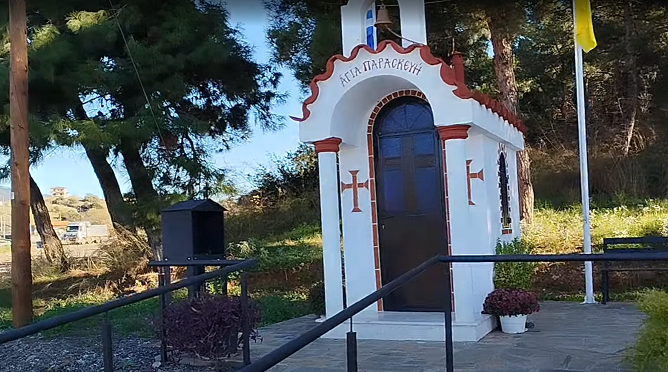
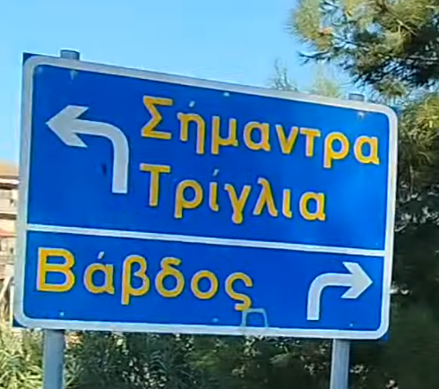
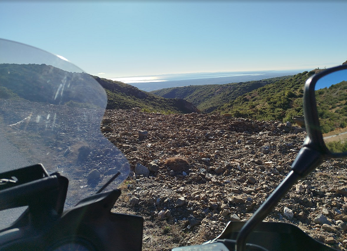

## Καφεδάκι στη Χαλκιδική 

Την πρώτη Δευτέρα του Δεκεμβρίου και λόγω καλού καιρού ευκαιρία για γρήγορη εξόρμηση. Μετά από πέρασμα από Λευκό Πύργο στάση στο Σκλαβενίτη στην Πυλαία για καφεδάκι και λήψη της κρίσιμης απόφασης. Προς τα που? 

Βέβαια η Χαλκιδική ήταν μονόδρομος αφού επέλεξα εκείνη την μεριά, και πάλι όμως η Χαλκιδική έχει 3 πόδια...

Η απόφαση ελήφθη...Ποσείδι για αναμνήσεις..

## Αλλαγή πορείας

Πρώτη στάση Μουδανιά και γρήγορο καφεδάκι για ξεμούδιασμα και έλεγχο χρόνου...δυστυχώς τα νούμερα δεν έβγαιναν λόγω υποχρεώσεων. 

Οπότε επιστροφή από μια πιο ενδιαφέρουσα διαδρομή. 

Η πρώτη σκέψη ήταν Πολύγυρος.

Φτάνοντας όμως στο Εκκλησάκι Οσίας Παρασκευής έξω από τα Σήμαντρα....

Και γυρνώντας το κεφάλι προς τα πίσω είδα την πινακίδα...
 

Είχα ακούσει καλά λόγια για αυτό το γραφικό ορεινό χωριό, έτσι είπα να πάω προς τα εκεί...

Ανεβαίνοντας προς Βάβδο.
 

## Στάση για γρήγορο φαγητο

Μετά το γρήγορο πέρασμα από Βάβδο, στάση στο Γαβανά έξω από τη Γαλάτιστα και επιστροφη πίσω.

